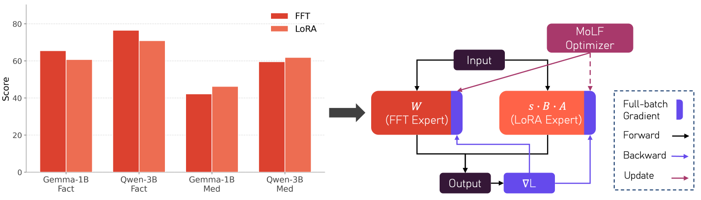

# MoLF: Mixture of LoRA and Full Fine-Tuning

<div align="center">
  <a href="https://arxiv.org/abs/2605.07111v1"></a> &ensp;
</div>

Reference implementation for **"Beyond LoRA vs. Full Fine-Tuning: Gradient-Guided Optimizer Routing for LLM Adaptation"**.

<p align="center"></p>

*Fig. 1 of the paper. Left: the FFT-vs-LoRA winner flips across model × task — a static choice is never optimal. Right: MoLF reparameterizes each target linear as `W + s·B·A` and lets the MoLF optimizer route the update to either the FFT expert or a LoRA expert at every step, while both keep receiving full-batch gradients through the dense forward pass.*

MoLF unifies Full Fine-Tuning (FFT) and Low-Rank Adaptation (LoRA) within a Mixture-of-Experts framework. Each target linear projection is reparameterized as a superposition of an FFT expert (the original dense weight) and one or more LoRA experts; a custom AdamW optimizer scores experts with the *Expected Preconditioned Descent* (EPD) statistic and applies a Top-K sparse update at every step, while every expert continues to receive full-batch gradient signals through the dense forward pass.

> **Branches.** This repo ships the two paper methods on separate branches:
> - **`main`** (this branch) — the MoLF: FFT + LoRA mixture (§4.1–4.3 of the paper).
> - **`molf-e`** — MoLF-Efficient (§4.4): base weight frozen, routing over a pair of LoRA experts of potentially different ranks. Check it out with `git checkout molf-e`.

## Methods provided

| Mode (`--mode`) | Description |
|---|---|
| `fft` | Full fine-tuning baseline. |
| `lora` | LoRA baseline (via `peft`). Rank set with `--lora_rank`. |
| `molf` | MoLF — FFT + LoRA experts routed at the optimizer level. |

Score functions (`--molf_score_fn`):
- `true_projected` *(default)* — **EPD** (paper Eq. 10); the score used throughout the main results.
- `projected` — **PFN** (paper Eq. 11); scale-invariant ablation comparator.

## Datasets and models

Three benchmarks, three base models — matching the paper's setup:

| Benchmark | HF id | Metric | Module |
|---|---|---|---|
| **SQL** (Text-to-SQL) | `gretelai/synthetic_text_to_sql` | exact-match accuracy on held-out queries | `src/data/sql.py`, eval in `src/evaluation/eval_helper/eval_sql.py` |
| **Med** (Medical QA) | `openlifescienceai/medmcqa` | 4-way MCQ accuracy on validation split | `src/data/medmcqa.py`, eval in `eval_medmcqa.py` |
| **Fact** (CounterFact) | bundled at `src/data/data_source/counterfact.json` | Efficacy Score (Meng et al.) | `src/data/fact.py`, eval in `eval_helper/eval_fact.py` |

| Model | HF id |
|---|---|
| Gemma-3-1B | `google/gemma-3-1b-pt` |
| Qwen2.5-1.5B | `Qwen/Qwen2.5-1.5B` |
| Qwen2.5-3B | `Qwen/Qwen2.5-3B` |

## Installation

```bash
conda create -n molf python=3.10 -y
conda activate molf
pip install -e .
# Optional: FlashAttention 2 (Ampere+ GPUs only)
# pip install flash-attn --no-build-isolation
```

Hardware: the paper used a single NVIDIA H100 or RTX PRO 6000 Blackwell per run. V100 is unsupported (no FlashAttention 2; the code falls back to SDPA/eager attention).

## Quickstart: a single MoLF run

```bash
torchrun --nnodes 1 --nproc_per_node=1 src/script/train.py \
    --model_name_or_path Qwen/Qwen2.5-1.5B \
    --dataset_type med \
    --mode molf \
    --molf_score_fn true_projected \
    --molf_topk 1 \
    --molf_lora_ranks "[128]" \
    --learning_rate 5e-5 \
    --lora_learning_rate 5e-5 \
    --weight_decay 0.1 \
    --lora_weight_decay 0.01 \
    --use_rslora True \
    --per_device_batch_size 8 \
    --gradient_accumulation_steps 4 \
    --num_train_epochs 2 \
    --lr_scheduler_type cosine \
    --warm_up_ratio 0.1 \
    --ckpt_dir_root ckpts/molf
```

`train.py` first fine-tunes, then merges the MoLF experts back into the base linears so the saved checkpoint is a vanilla `transformers` model. After training, the corresponding evaluator (`evaluate_sql` / `evaluate_medmcqa` / `evaluate_fact`) is called automatically and a result row is appended to the CSV at `$LOG_FILE`. The per-step expert-selection log (`molf_expert_selection.jsonl`) is written under `ckpts/.../<run_name>/` and is what produces the routing-dynamics plots (paper Figures 4–6).

## Reproducing the baseline sweeps

Two SLURM array scripts at the top of `scripts/` reproduce the FFT and LoRA baseline hyperparameter searches from the paper appendix (Table 4) on the Med benchmark; adapt the `DATASET_TYPE` / model list / LR grid to cover the other paper cells:

```
scripts/
├── fft_med_exp.sh   # FFT baseline sweep (paper Table 1, Table 2 "FFT")
└── lora_med_32.sh   # LoRA baseline sweep at rank 32 (paper Table 1)
```

Each script runs a `3 models × 3 LRs × 2 LR-schedulers = 18`-job array. The SLURM headers (partitions, `conda activate dft`, `CTIME_DATA=/data/user_data/...`) reflect the cluster they were authored on; adapt them to your environment. For MoLF runs, use the single-command quickstart above and vary `--molf_*` / `--dataset_type` as needed.

## Code layout

```
src/
├── config/         # TrainingConfig (draccus) + adapter configs
├── data/           # SQL / MedMCQA / CounterFact dataset builders
├── evaluation/
│   └── eval_helper/   # evaluators that train.py imports after training
├── model/molf.py   # MixtureOfLoRAFull module + wrap/merge utilities
├── optim/
│   ├── molf_adamw.py     # Top-K sparse AdamW with per-module routing
│   ├── molf_metric.py    # EPD (true_projected) + PFN (projected) score functions
│   └── param_group.py    # Per-module subgroup builder (FFT vs each LoRA expert)
├── trainer/
│   ├── base_trainer.py   # FFT + LoRA baselines
│   └── molf_trainer.py   # MoLF training loop & checkpoint merge
└── script/
    ├── train.py        # Entry point (draccus-wrapped main)
    └── count_params.py # Parameter-count utility
```

## Citation

```bibtex
@article{tang2026molf,
  title={Beyond LoRA vs. Full Fine-Tuning: Gradient-Guided Optimizer Routing for LLM Adaptation},
  author={Tang, Haozhan and Zhu, Xiuqi and Zhang, Xinyin and Li, Boxun and Smith, Virginia and Kuo, Kevin},
  journal={arXiv preprint arXiv:2605.07111},
  year={2026}
}
```
